# Лабораторная работа №4. Работа с DOM-деревом и событиями в JavaScript

_Вариант 2_

## Цель работы

Научиться работать с DOM-элементами, управлять динамическим добавлением и удалением объектов, взаимодействовать с HTML-элементами с помощью событий (`onClick`, `onHover`) и использовать делегирование событий.

## Условие

### Шаг 1. Настройка проекта

1. Создайте корневую папку проекта.
2. В корневой папке создайте директорию `/src`, где будет храниться весь код.
3. В `/src` создайте файлы:
   - `index.js` – главный файл, импортирующий другие модули.
   - `inventory.js` – модуль для работы с массивом предметов.
   - `ui.js` – модуль для обновления интерфейса (отрисовка таблицы, формы и т. д.).
   - `utils.js` – вспомогательные функции (генерация ID, обработка цветов и т. д.).
   - `classes.js` – модуль с классами Item и Weapon.
4. Создайте `index.html` в корневой папке и подключите `index.js` с `type="module"`.
5. Создайте `style.css` и подключите его к HTML.

### Шаг 2. Создание классов `Item` и `Weapon`

1. **Класс `Item` (базовый класс предмета)**

   - Поля:
     - `id` – уникальный идентификатор предмета.
     - `name` – название предмета.
     - `category` – категория (`armor`, `weapon`, `potion`).
     - `rarity` – редкость (`common`, `uncommon`, `rare`, `legendary`).
     - `description` – описание предмета.
   - Методы:
     - `getInfo()` – возвращает строку с информацией о предмете.
     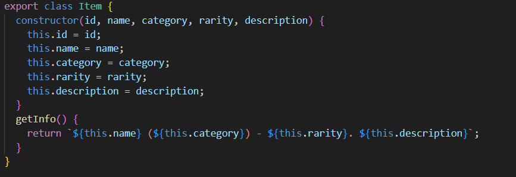

2. **Класс `Weapon` (наследуется от `Item`)**
   - Дополнительные поля:
     - `damage` – урон оружия.
   - Методы:
     - `attack()` – выводит сообщение `"Оружие {name} нанесло {damage} урона!"`.
     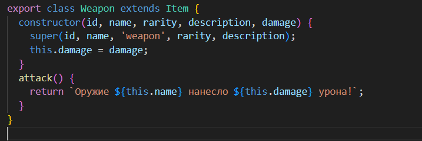

### Шаг 3. Создание HTML-интерфейса

1. Создайте пустую HTML-таблицу, куда в дальнейшем будут добавляться предметы инвентаря.
2. Таблица должна содержать следующие столбцы.
   - Название предмета.
   - Категория.
   - Редкость.
   - Действие (кнопка удаления предмета).

### Шаг 4. Добавление предметов

1. Создайте функцию `addItemToInventory()`, которая:
   - Создает объект предмета с данными из формы.
   - Добавляет объект в массив `inventory`.
   - Создает новую строку таблицы с данными предмета.
     - Если предмет легендарный, строка должна быть золотого цвета.
     - Если предмет обычный, строка должна быть серого цвета.
     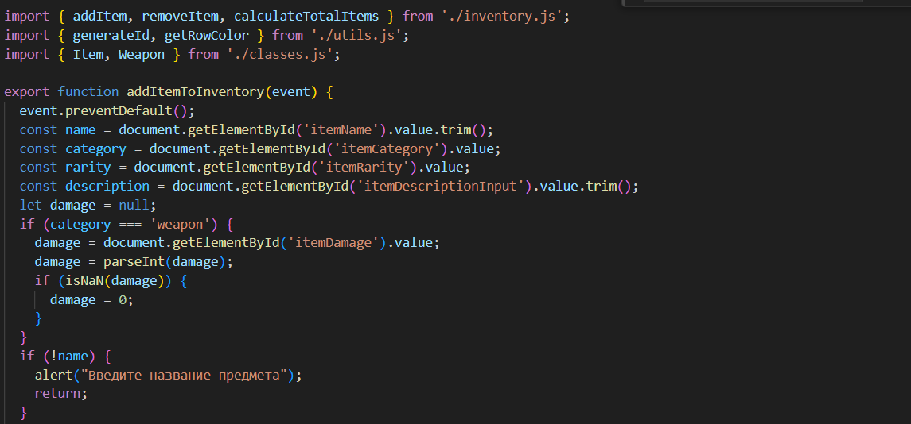
     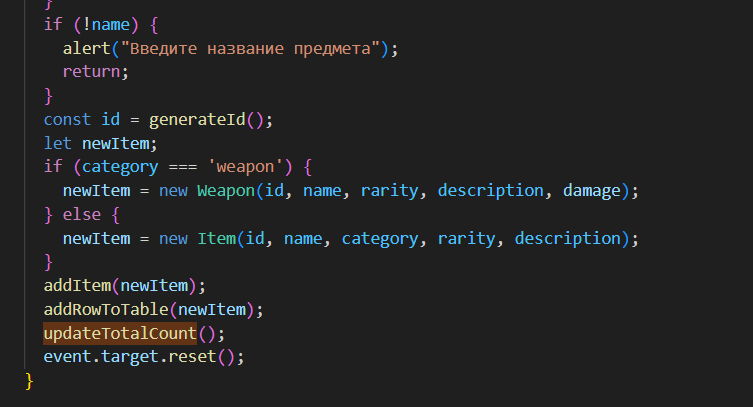
     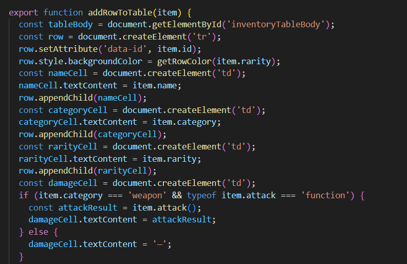
     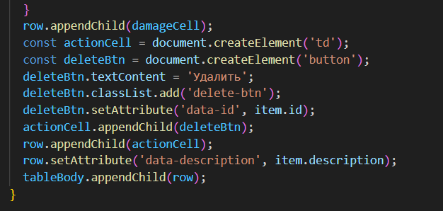
     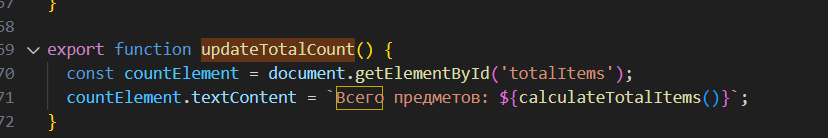
### Шаг 5. Управление предметами

1. В каждой строке таблицы добавьте кнопку удаления.
2. При клике на кнопку удаления получите идентификатор предмета и удалите его из таблицы и массива inventory.
3. Обработчик событий на клик на кнопку определите для элемента <table> (используйте делегирование событий).
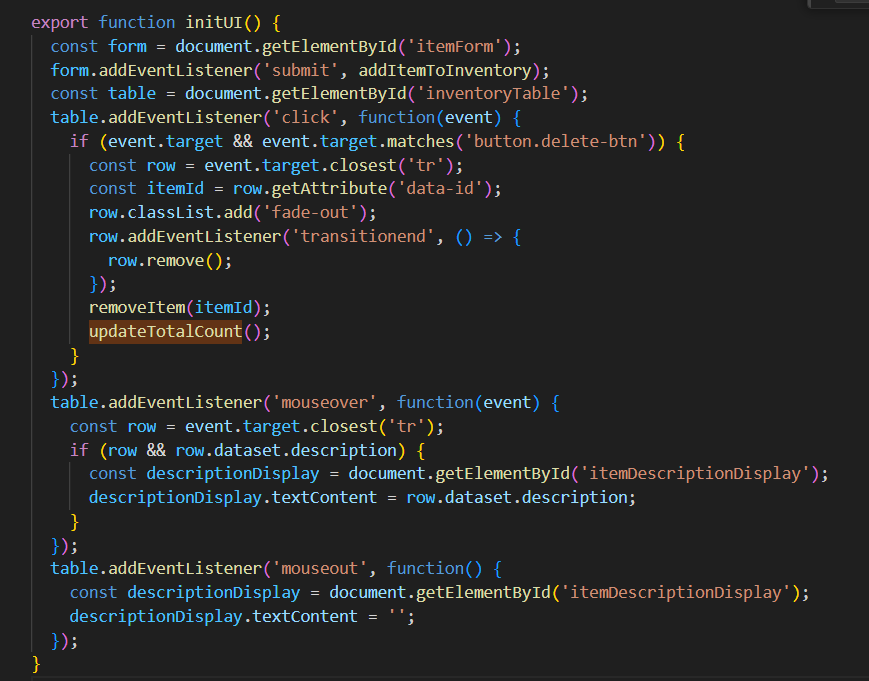

### Шаг 6. Подсчет количества предметов

1. Напишите функцию `calculateTotalItems()`, которая будет вызываться после добавления или удаления предмета.
2. Отобразите общее количество предметов в инвентаре в отдельном элементе.
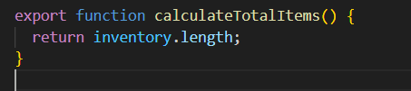

### Шаг 7. Отображение информации о предмете

1. В файле `index.html` создайте блок для отображения подробного описания предмета.
2. При наведении (`onHover`) на строку таблицы, отображайте полное описание в элементе `
` или `
` ниже таблицы.
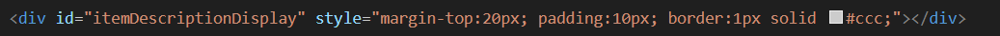
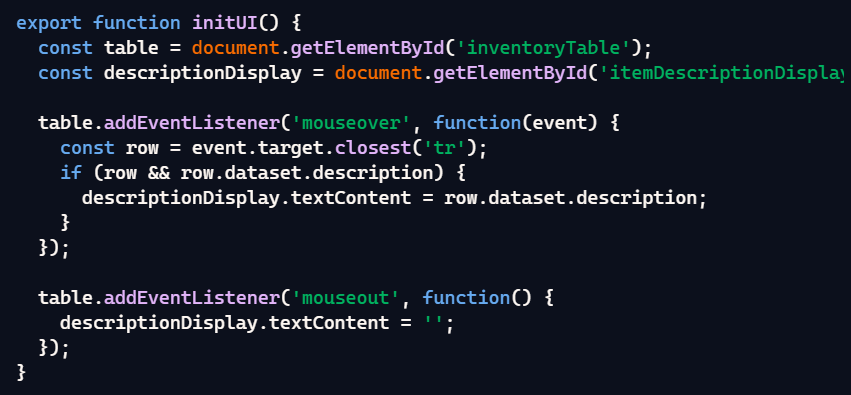
### Шаг 8. Добавление предметов через форму

1. Добавьте форму на страницу для добавления предмета в таблицу (категория и редкость должны быть `select`).
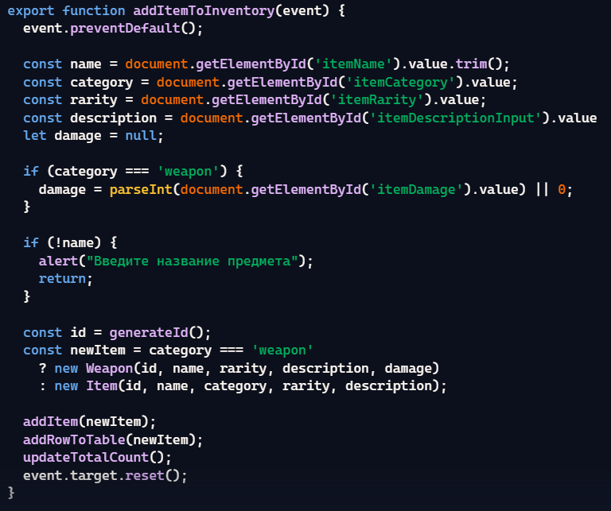

### Шаг 8. Вызов метода `damage()` для оружия

1. Добавьте в таблицу новую колонку `"Урон"`, но только для предметов категории weapon.
2. Реализуйте автоматический вызов метода `damage()` для оружия при его добавлении и отобразите результат в соответствующей ячейке таблицы.
3. Для предметов других категорий в колонке `"Урон"` должно отображаться `"—"`.
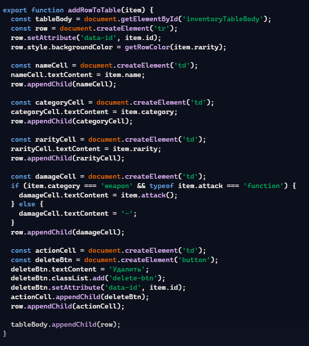

## Документирование кода

Код должен быть корректно задокументирован, используя стандарт `JSDoc`. Каждая функция и метод должны быть описаны с указанием их входных параметров, выходных данных и описанием функционала. Комментарии должны быть понятными, четкими и информативными, чтобы обеспечить понимание работы кода другим разработчикам.

## Контрольные вопросы

1. Каким образом можно получить доступ к элементу на веб-странице с помощью JavaScript?
Доступ к элементу можно получить с помощью методов document.querySelector(), document.getElementById(), document.getElementsByClassName() и document.getElementsByTagName().
2. Что такое делегирование событий и как оно используется для эффективного управления событиями на элементах DOM?
Делегирование событий — это техника обработки событий, при которой слушатель событий устанавливается на родительский элемент, а обработка выполняется для вложенных элементов через event.target. Это полезно для динамически создаваемых элементов.
3. Как можно изменить содержимое элемента DOM с помощью JavaScript после его выборки?
Изменение содержимого элемента можно выполнить с помощью innerHTML, textContent или innerText.
4. Как можно добавить новый элемент в DOM-дерево с помощью JavaScript?
Добавление нового элемента выполняется через createElement() и appendChild() или append().